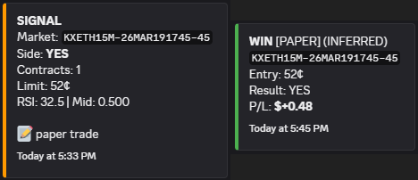
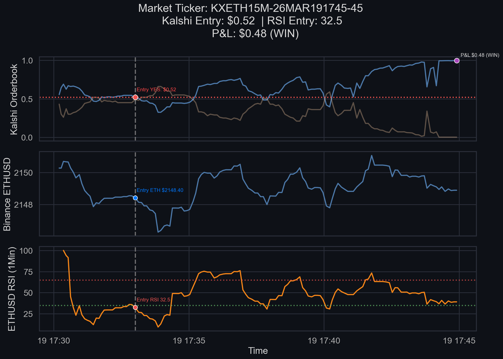

# Prediction Market Trading Bot

This project showcases a simple trading model that trades Kalshi 15-minute cryptocurrency prediction markets using a simple RSI signal and an entry-zone filter. It is designed as a backbone skeleton example to build actual strategies on. I am using this naive trading model as one of many baselines against my actual trading strategy. 

**Note**: This is a LIVE trading bot (with paper trading capabilities) that is able to place orders. Be sure to read the instructions carefully and run the correct flags. Use at your own risk. 

### Overview
- Ingests real-time Kalshi 15-minute crypto markets (BTC, ETH, SOL, XRP) via websocket API.
- Ingests real-time Binance spot prices via websocket API.
- Combines data into a unified table.
- Generates a trading signal based on RSI.
- Logs market data, trades, and resolutions to a DuckDB database.
- Sends Discord webhook alerts for live trade activity and resolutions.

**Simple Trading Strategy: RSI Overbought/Oversold**
- Entry zone: Kalshi mid price between 0.30 to 0.70 (Do not buy below 0.30 or above 0.70).
- Buy YES when Binance RSI < 35 (oversold) AND when YES bid is in the entry zone.
- Buy NO when Binance RSI > 65 (overbought) AND when NO bid is in the entry zone.

### Visualizations

**Example Discord Pings**



**Example Trade**



### Files
- `live_bot.py`: Live trading bot (paper-trades by default).
- `analyze_trades.ipynb`: Notebook for reviewing and visualizing trades.
- `market_data.db`: DuckDB database (created/updated by the bot).

### Setup
1. Create a Python virtual environment and install dependencies in `requirements.txt`:

```bash
python -m venv .venv
. .venv/bin/activate  # Windows: .venv\Scripts\activate
pip install -r requirements.txt
```

2. Ensure you have a Kalshi API key and a private key file (PEM).

3. Create a `.env` file in the project root:

```env
KALSHI_KEY_ID=your_kalshi_key_id
KALSHI_PRIVATE_KEY_PATH=private_key.pem
KALSHI_ENV=prod
DB_PATH=market_data.db
DISCORD_WEBHOOK_URL=https://discord.com/api/webhooks/...
```
- Add your Kalshi keys, DuckDB path, and Discord webhook **at your own risk**.

**DuckDB**
- The bot writes to `market_data.db` by default.
- You can point to a different DB file using `DB_PATH`.

**Kalshi**
- `KALSHI_ENV` can be `prod` or `demo`.
- `KALSHI_PRIVATE_KEY_PATH` should point to your PEM key file.

**Discord**
- Set `DISCORD_WEBHOOK_URL` to receive alerts.
- Leave it empty to disable alerts.

**Run Trading Bot 24/7 (READ CAREFULLY)**
```bash
python live_bot.py                          # Paper trade
python live_bot.py --contracts 10           # Paper trade w/ 10 contracts
python live_bot.py --live --contracts 10    # LIVE trade w/ 10 contracts
```
- Paper trading is set by default using `DRY_RUN = True` in `live_bot.py`. Flip to `False` or use the `--live` flag above only when you fully understand the risks.

Good luck, have fun!